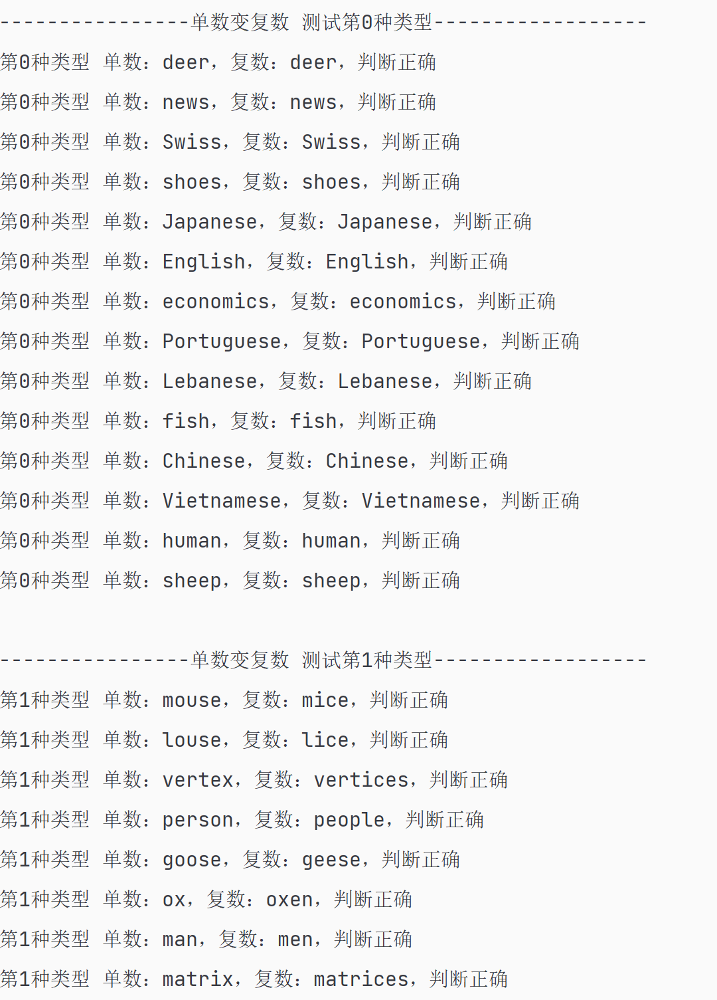
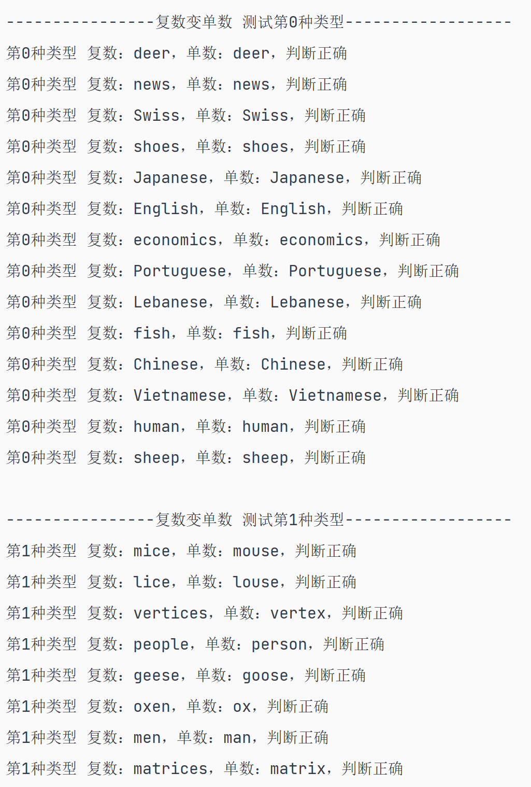

# EnglishWordSingularizeAndPluralize 
英文单词单数复数形式转换

### 一、使用指南

1、单数 -> 复数
```java
String plural = EnglishWordUtil.pluralize("map");
```
2、复数 -> 单数
```java
String singular = EnglishWordUtil.singularize("maps");
```

### 二、支持的类型
0、单复数同形

deer,shoes,sheep,Chinese,news...

1、单数复数的不规则变化

person,man,child,foot...

2、直接加"-s"的x国人

German,Russian,American...

3、以s, ss，x, ch, sh结尾的名词加"-es"

bus,class,watch...

4、以元音字母+o结尾（除studio），后面加"-s"

zoo,kangaroo...

5、以辅音字母+o结尾（除studio,piano,kilo,photo)，后面加"-es"

hero,potato,tomato...

6、以辅音字母加y结尾的名词，变y为i加"-es"
city,factory,family...

7、以元音字母加y结尾的名词直接加"-s"
boy,toy,monkey...

8、除了roof，gulf，proof，beef，staff，belief，cliff，以fe或f结尾的名词，把fe或f变为v加"-es"

knife,wolf,life,cliff...

9、无连字号复合名词，后面名词变复数

mooncake,gentleman,housewife...

10、普通名词，加s

map,orange...

### 三、原理：正则

### 四、测试类

运行EnglishWordUtilTest的main方法：


